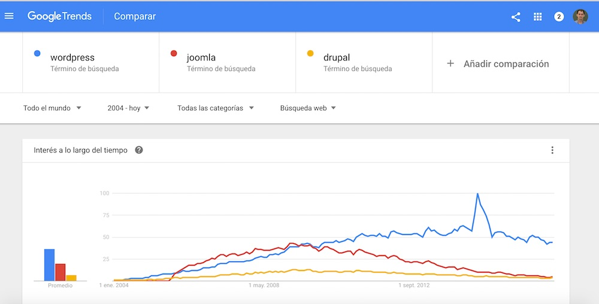
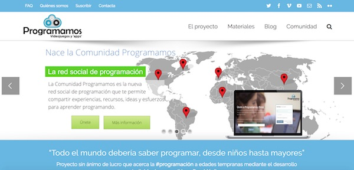
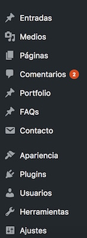

Si aún no conoces Wordpress, es hora de descubrir algo nuevo. Bajo este nombre se esconde un software genial con el que podemos crearnos nuestro propio sitio web en muy poco tiempo y de una forma sencilla. Reune ciertas características que hacen que hoy en día sea la alternativa número uno a la hora de elegir un sistema gestor de contenidos (CMS) para crear nuestras webs. 

Tanto si quieres crear un simple blog, una landing page para una empresa o una tienda virtual, Wordpress te permite realizarlo cómoda y rápidamente. 

# ¿Quién usa Wordpress?

No es mi intención avivar el debate de qué gestor de contenidos es el mejor hoy día. Además, es difícil saber con exactitud qué sistema es el más utilizado actualmente. Sin embargo, podemos usar Google Trends para ver la tendencia en las búsquedas de Google de tres CMS concretos y compararlos.

Aquí te dejo los resultados de [esta búsqueda](https://www.google.com/trends/explore?date=all&q=wordpress,joomla,drupal) para que juzgues por ti mismo:

# Los aspectos que más me gustan de Wordpress

Son ya muchos años construyendo webs y trabajando con esta herramienta. ¿Por qué me gusta tanto? Aquí te enumero algunas de las características que personalmente creo que hacen de Wordpress una buena elección.

* La **sencillez** a la hora de crear y administrar nuevas páginas o entradas en nuestro blog. Tanto si eres un profesional de la informática como si estás dando tus primeros pasos, con Wordpress podrás crear sitios impresionantes.
* Una gestión simplificada de los **elementos multimedia** que queramos incluir. Añade, edita o borra imágenes para incluirlas en tu web con solo arrastrar y soltar.
* Te permite personalizar al máximo la apariencia del sitio. A través de **temas de apariencia**, puedes cambiar el aspecto de tu web en unos segundos. Más adelante, en otra entrada, hablaremos de la importancia de elegir un buen tema de apariencia.
* Se adapta para que puedas construir cualquier web que necesites. Para ello Wordpress hace uso de **plugins**, que permiten añadir nuevas funcionalidades a nuestro sofware original. Con ellos, puedes incluso convertir tu sitio web en una tienda virtual o una red social.
* Funciona muy bien y está en constante crecimiento, añadiendo mejoras cada poco tiempo.
* Por último, Wordpress es **software libre**, por lo que podrás acceder, modificar y compartir el código fuente del proyecto.

# Más cosas de este sistema

Wordpress tiene dos partes diferenciadas:

1. **Front-End** o parte pública del sitio web. O dicho de otra forma, lo que todo el mundo ve cuando accede a tu web.

2. **Back-End** o parte de administración de Wordpress. A este apartado solo se puede acceder tras haberse logueado con un usuario con privilegios. Desde este podemos administrar toda nuestra web: crear nuevas entradas, páginas, usuarios, etc.

Y ¿qué podemos administrar? muchas cosas. Entre ellas:

* Los **usuarios**. Puedes dar de alta a distintos usuarios para que puedan acceder al apartado de administración de tu sitio. Los permisos que tendrán dichos usuarios dependerán del rol que les asignes.
* Crear **páginas (pages)** o **entradas (posts)**. Aunque son parecidos no son lo mismo. Las **páginas** se usan para crear diferentes tipos de contenido estático, como por ejemplo: una página de contacto, Acerca de, etc. Las **entradas** son cada una de las publicaciones que van a componer nuestro blog.
* Gestionar el contenido multimedia, a través del apartado **"Medios"**.
* Personalizar la **apariencia** para que el sitio esté a tu gusto.
* Añadir nuevas funcionalidades desde **"Plugins"**.

# Si me gusta tanto Wordpress, ¿por qué he montado este blog con Jekyll?

Cada sitio que quieras crear tiene sus propias características y necesidades. Sí, me gusta Wordpress, pero también existen otras alternativas muy interesantes que te permiten crear sitios con un resultado muy bueno. En el caso de este blog he optado por [**Jekyll**](https://jekyllrb.com/) por tres razones:

1. Es la tecnología que nos propone GitHub para crear sitios y nos permite almacenarlos directamente en nuestro respositorio. Por tanto nos ahorramos la contratación de un hosting.
2. Si estás familiarizado con un sistema de control de versiones como GitHub, tener tu blog ahí te proporciona muchas ventajas, como ver qué cambios has ido realizando en el código que hace que tu blog funcione.
3. El resultado es impresionante. Jekyll genera y almacena las páginas html, por lo que el acceso a la web es muy rápido.

Pero prefiero dejar Jekyll para otro post, en el que analicemos sus características y veamos cómo funciona.

En resumen, si no eres un usuario avanzado, sin duda te recomiendo iniciarte con Wordpress.