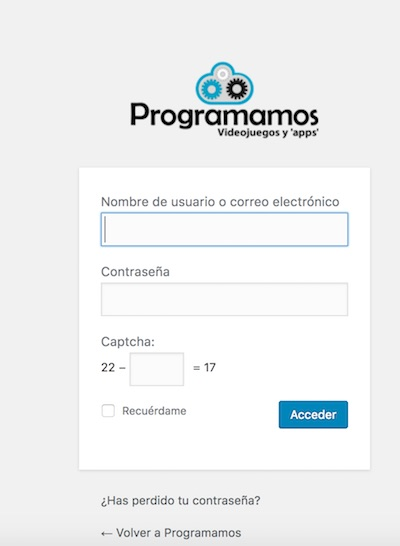

Hay muchos temas de apariencia que solucionan este problema, pero muchos otros no. Para esos casos, la solución es muy sencilla. Tan solo tendremos que añadir algo de código a nuestro Wordpress.

Lo primero que hay que hacer es editar el archivo **functions.php** de tu tema de apariencia. Para ello, lo más sencillo es acceder a "Apariencia - editor" de la parte de administración de nuestro Wordpress y seleccionar "functions.php". A continuación, añade el siguiente código:

```php
// Logo personalizado en login

add_action("login_head", "my_login_head");
function my_login_head() {
	echo "
	<style>
	body.login #login h1 a {
		background: 
url('".get_bloginfo('template_url')."/images/ProgramamosLogo.png') 
no-repeat scroll center top transparent;
		height: 99px;
		width: 220px;
	}
	</style>
	";
}

// personalizar url logo acceso
add_action( 'login_headerurl', 'my_custom_login_url' );
function my_custom_login_url() {
return 'http://programamos.es';
}
     }
```

Y eso es todo. A partir de ahora la página de acceso a la administracion de tu Wordpress mostrará tu logo y al hacer clic te llevará a la página principal. Este es el resultado:



¡Hasta otra!