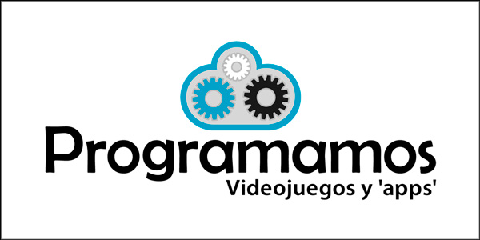
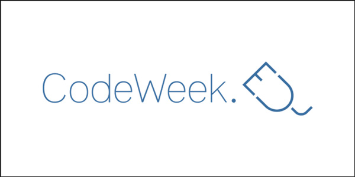
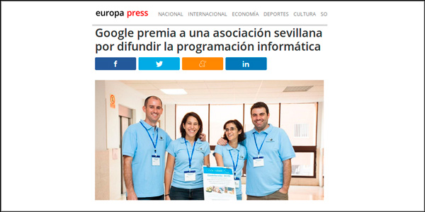

## Proyectos en los que participo o he participado

<figure class="third">
	
	
	<figcaption>Co-fundador de Programamos y Embajador de España de la Semana Europea de la Programación (CodeWeek)</figcaption>
</figure>

## Medios en los que he intervenido

<figure class="third">
	
	
    
    
    
    
	<figcaption></figcaption>
</figure>